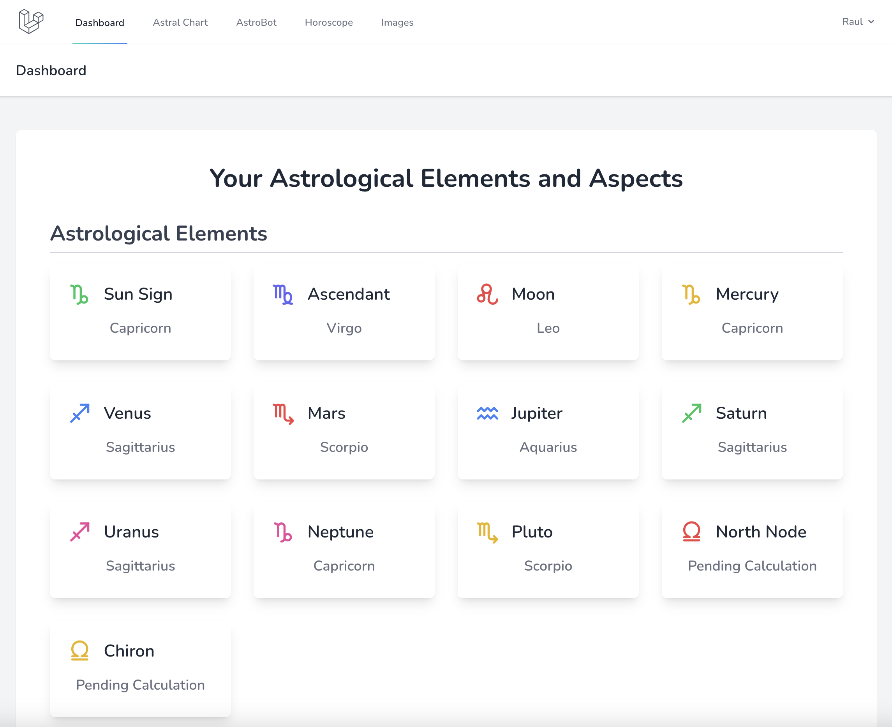
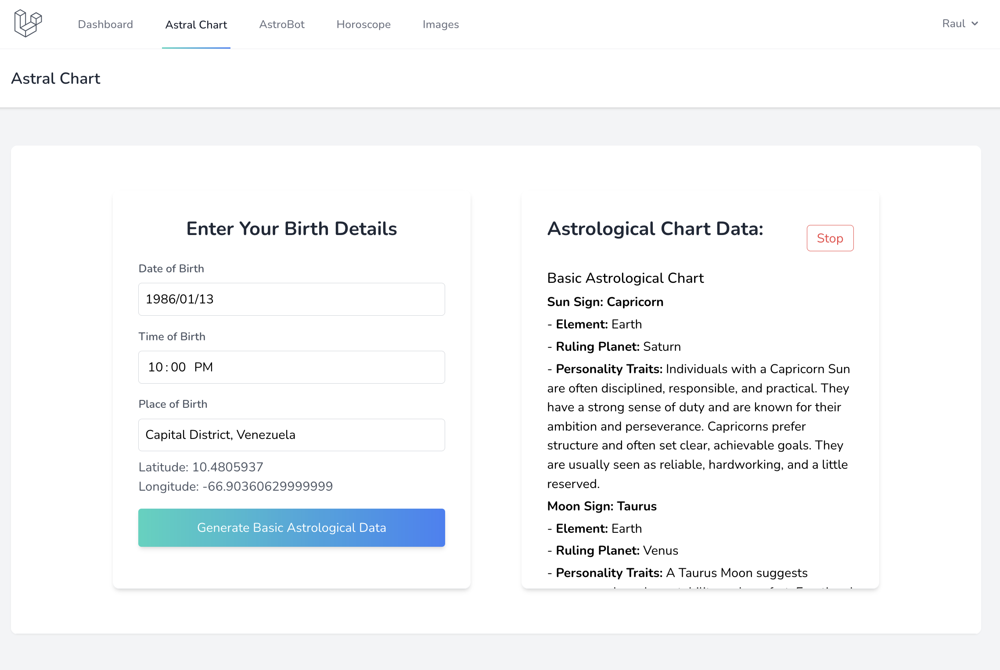
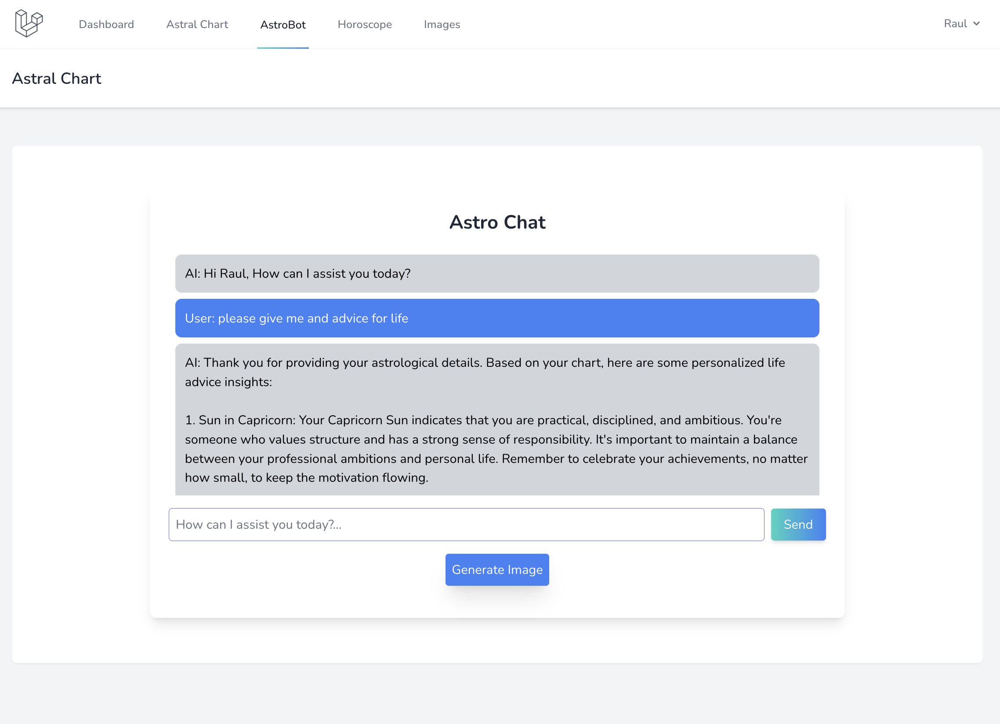
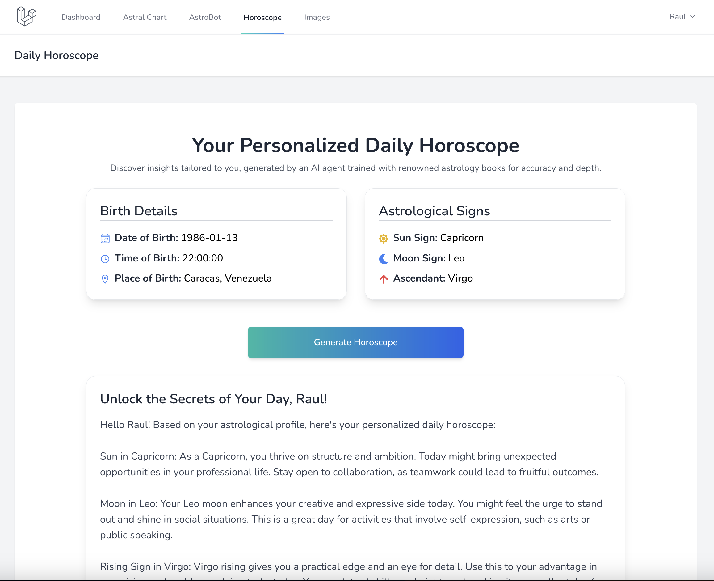
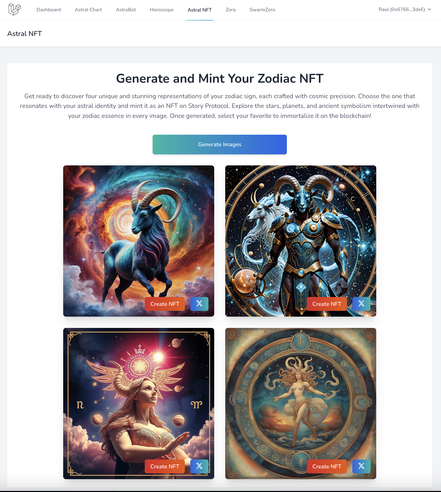
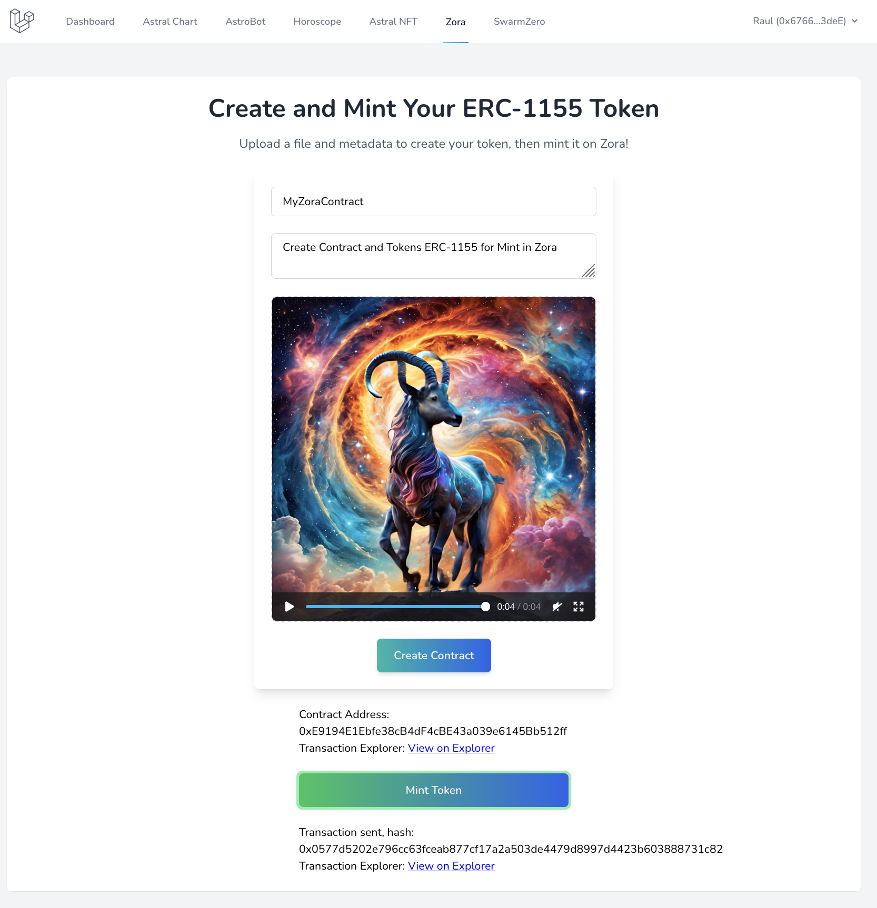
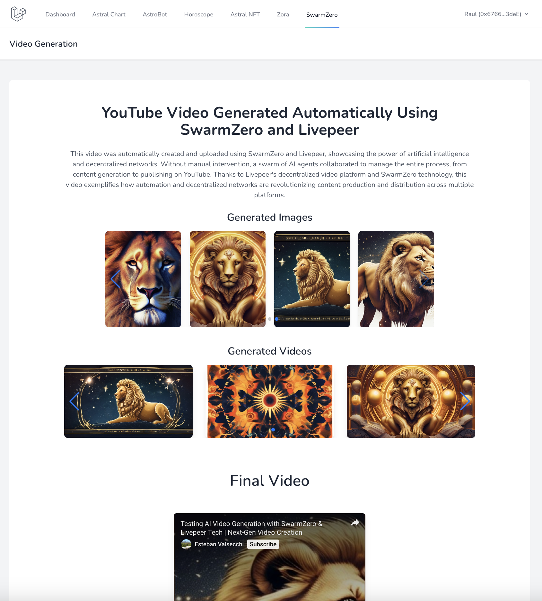

# Oracle AI

Oracle AI is an advanced astrology platform that allows users to generate their natal (astral) chart and explore in-depth interpretations of their astrological elements. It also includes features to generate daily horoscopes, chat with an AI expert in astrology, and even create NFTs from astrology-based images and videos.

## Project Overview

The project centers around the generation of the user's astral chart, providing a detailed summary of their chart along with explanations of each astrological element, aspects, and advanced elements. Additionally, users can generate their daily horoscope and chat with an AI-powered astrology expert, "Astrobot," to ask questions or even generate images related to their conversations.

### Modules

- **Dashboard**: A summary view of the user's natal chart with key astrological elements.
- **Astral Chart**: Allows users to generate their complete astral chart, and it provides an audio summary of the chart.
- **Astrobot**: An AI-powered expert in astrology that can chat with users, answer their astrological questions, and generate related images based on their conversations.
- **Horoscope**: A section where users can generate their daily horoscope based on their natal chart.
- **Astral NFT**: Users can generate images based on their zodiac sign, mint them as NFTs using Livepeer for image generation and Story Protocol for the minting process.
- **Zora**: Users can create ERC-1155 contracts and mint tokens. Livepeer is used to generate images, which are turned into videos, then the token is minted on the Zora blockchain.
- **SwarmZero**: We successfully implemented the Livepeer YouTube Video Generator with SwarmZero, following the process of generating and uploading videos to YouTube using AI agents and decentralized networks. By leveraging Livepeer’s decentralized video platform, these agents collaborate to create and manage videos without manual intervention, with results displayed in the SwarmZero section. This allows for exploring automated and decentralized solutions for media content creation and distribution.

### Hackathon Features

For this hackathon, we’re showcasing several cutting-edge integrations:

- **Livepeer & Story Protocol**: In the Astral NFT section, users can generate images based on their zodiac signs and mint them as NFTs. These images are displayed in the UI and can be shared or turned into NFTs using Story Protocol’s blockchain.
- **Zora & ERC-1155 Tokens**: Users can create an ERC-1155 contract and mint tokens. Images are first generated by Livepeer, then converted into videos, which are subsequently minted as tokens on the Zora network.
- **SwarmZero Integration**: We effectively integrated the Livepeer YouTube Video Generator with SwarmZero, utilizing AI agents and decentralized networks to automate the creation and upload of videos to YouTube.  

### How to Run the Project

#### Requirements:
- PHP 8 or higher
- MySQL database
- Node.js 18 or higher
- OpenAI API key
- Huggingface API key
- Livepeer API key
- SwarmZero API key
- Zora SDK

#### Steps to Execute:

1. Clone the project repository:
   ```bash
   git clone https://github.com/raulgonve/oraculo.git
    ```

2. Backend (Laravel):
   - Navigate to the project root and run:
   ```bash
   composer install
   ```
   - Copy .env.example to .env and fill in the database connection details.
   - Run the migrations and seed the database:
   ```bash
   php artisan migrate --seed
   ```
   - Start the Laravel backend server:
   ```bash
   php artisan serve
   ```

3. Frontend (Next.js):
   - Navigate to the `breeze-next` folder:
   ```bash
   cd breeze-next
   ```
   - Copy .env.example to .env and complete the required information.
   - Start the Next.js development server:
   ```bash
   npm run dev
   ```

### Project Members
   - Esteban Valsecchi - Developer
   - Raul Gonzalez - Developer

### Contact Information
   - Discord Users:
     - @cryptobull13
     - @cryptowolf

## Screenshots

Here are some screenshots of the main modules of Oracle AI:

- **Dashboard**: Summary view of the user's astral chart.
  

- **Astral Chart**: The user's complete astral chart with an audio summary.
  

- **Astrobot**: Chat with the AI-powered astrology expert.
  

- **Horoscope**: Daily horoscope generation based on the user's natal chart.
  

- **Astral NFT**: Generate and mint NFTs using images created with Livepeer.
  

- **Zora**: Create ERC-1155 contracts, mint tokens, and generate videos using Livepeer.
  

- **SwarmZero**: Generate images and videos and upload them directly to YouTube using SwarmZero.
  
