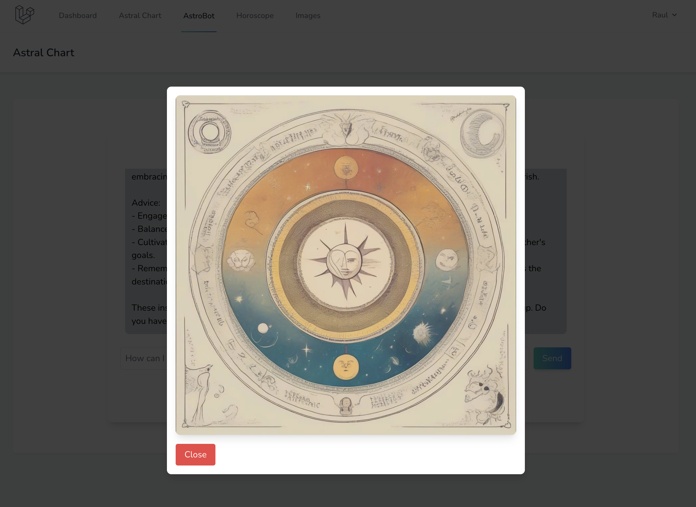

# Oracle AI

Oracle AI is an advanced astrology platform that allows users to generate their natal (astral) chart and explore in-depth interpretations of their astrological elements. It also includes features to generate daily horoscopes and chat with an AI expert in astrology.

## Project Overview

The project is centered around the generation of the user's astral chart, providing a detailed summary of their chart and explanations of each astrological element, aspects, and advanced elements. Additionally, users can generate their daily horoscope and chat with an AI-powered astrology expert, "Astrobot," to ask questions or even generate images related to their conversations.

### Modules

- **Dashboard**: A summary view of the user's natal chart with key astrological elements.
- **Astral Chart**: Allows the user to generate their complete astral chart, and it provides an audio summary of the chart.
- **Astrobot**: An AI-powered expert in astrology that can chat with users, answer their astrological questions, and generate related images based on their conversations.
- **Horoscope**: A section where users can generate their daily horoscope based on their natal chart.

## How to Run the Project

### Requirements:
- PHP 8 or higher
- MySQL database
- Node.js 18 or higher
- OpenAI API key
- Huggingface API key
- OpenAI Assistant ID
- OpenAI Vector Store ID (generated by loading the attached books in the project's `public` folder)

### Steps to Execute:

1. Clone the project repository:
   ```bash
   git clone https://github.com/raulgonve/oraculo.git
    ```

2.	Backend (Laravel):
	•	Navigate to the project root and run:
    ```bash
   composer install
    ```
    •	Copy .env.example to .env and fill in the database connection details.
	•	Run the migrations and seed the database:
    ```bash
   php artisan migrate --seed
    ```
    •	Start the Laravel backend server:
    ```bash
    php artisan serve
     ```

3.	Frontend (Next.js):
	•	Navigate to the breeze-next folder:
    ```bash
    cd breeze-next
    ```
    •	Copy .env.example to .env and complete the required information.
	•	Start the Next.js development server:
    ```bash
    npm run dev
    ```

### Project Members
	•	Adam White - Designer
	•	Esteban Valsecchi - Developer
	•	Raul Gonzalez - Developer

### Contact Information
   	•	Discord Users:
	•	@spinalcracka
	•	@cryptobull13
	•	@cryptowolf

## Screenshots

Here are some screenshots of the main modules of Oracle AI:

- **Dashboard**: Summary view of the user's astral chart.
  

- **Astral Chart**: The user's complete astral chart with audio summary.
  

- **Astrobot**: Chat with the AI-powered astrology expert.
  

- **Horoscope**: Daily horoscope generation based on the user's natal chart.
  

- **Image Generation**: Generate images based on the chat with Astrobot.
  
